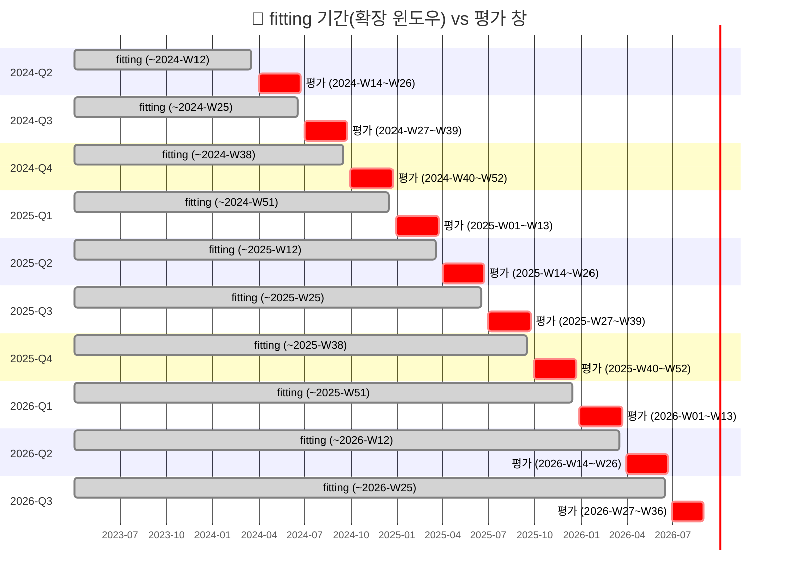

# EDA 결과 (2단계, fitting 기간 분석)

## 가정 및 전제

- **fitting 기간 정의**: `folds.csv`의 10개 평가 창 각각의 `train_until`을 그 창의 fitting 상한으로 삼아, **모든 분석을 10개 창 각각에 대해 독립적으로 반복**했다(가장 엄밀한 옵션 — 사용자가 직접 선택). 어떤 fold의 분석에서도 그 fold의 평가 창(target_start~target_end) 기간 데이터는 사용하지 않았다.
- `plant_meta.csv`는 `first_sample_week ≤ train_until`인 처리장만 사용했고, 미래 시점 정보인 `in_current_registry`·`last_sample_week`는 열 자체를 분석에서 배제했다.
- 로그 변환이 필요한 검정(A, B, 교차상관)은 `conc_mean`·`conc_3wk_avg`·`conc_mean_national`·`covid_cases_national`이 모두 양수·존재하는 행만 사용했다(README와 동일 원칙).
- 재현 코드는 `notebooks/01_fitting_period_eda.ipynb`(전체 실행 검증 완료, 에러 0건)에 있고, 생성 그림은 `figures/01~04.png`이다.
- 사용자가 사전에 지적한 대로, 이 데이터셋은 KOWAS 원본의 2026-09-14 스냅샷이므로 fitting 구간을 좁혀도 README의 "전체데이터" 수치와 **정확히 일치하지는 않을 수 있다** — 뒤에서 이 차이를 정직하게 보고한다.

### fitting 구간 vs 평가 창 타임라인

모든 fold의 fitting 구간은 패널 시작 주(2023-W14)에서 출발해 해당 fold의 `train_until`까지로 **확장(expanding window)**되며, 평가 대상 구간(target_start~target_end)과 겹치지 않는다.

---

## 1. 기술통계

지역별 `conc_mean` 수준은 마지막 fold(2026-Q3, train_until=2026-W25, 168주 관측 가능)에서 최대 100배 이상 차이 난다 — 대구 평균 1,584,203 vs 제주 평균 2,930(그림 없음, `notebooks/_desc_region_last_fold.csv`). 표준편차도 평균보다 큰 지역이 많아(대구 std 5,179,764) README §5-2의 "시·도 간 100배 이상 차이" 경고가 fitting 데이터에서도 그대로 확인된다. 결측(`n_missing`)은 서울이 32주로 가장 많고 제주·대전은 5~6주로 적어, 결측 패턴도 지역마다 다르다.

전국 평균 농도 추이(`figures/01_national_trend.png`)는 연도별로 뚜렷한 하락 추세를 보인다(2023년 수만~십만대 → 2026년 수백~수천대), README §5-2가 보고한 "연도별 중앙값 하락(55,555→8,520→5,350→1,359)"과 방향이 일치한다. 회색 세로선(각 fold의 train_until)은 fold가 진행될수록 더 많은 하락 구간을 포함하게 됨을 보여준다.

## 2. 검정 A·B 재현 (README §5-4)

**검정 A(강수 희석 부분상관)**: fold별 결과는 `figures/02_testA_testB_by_fold.png`(좌)에 정리했다. 표본이 작은 2024-Q2·Q3(n=763·984)에서는 r=+0.026 내외로 README 부호(−0.007)와 **반대**였지만, 표본이 2,000행을 넘는 2025-Q4 이후부터는 r=−0.011~−0.023으로 **README와 같은 방향(음의 상관, 크기도 비슷한 자릿수)**으로 수렴했다. 마지막 fold(n=2,667)의 r=−0.012는 README 전체데이터(−0.007)와 부호·크기가 모두 근접한다.

**검정 B(기상 추가 설명력 ΔR²)**: 우측 그림. 모든 fold에서 ΔR²는 **0.0002~0.0012의 매우 작은 양수**로, README(+0.0002)와 같은 결론("기상 추가해도 설명력 거의 안 늘어남")을 뒷받침한다. 다만 fold별 값 자체는 단조롭지 않다 — 2025-Q1(n=1,423)에서 0.00116으로 피크를 찍은 뒤 표본이 늘수록 오히려 README 값(0.0002)에 가까워진다. 즉 **표본이 작을수록 우연에 의한 변동폭이 크고, 표본이 늘수록 README의 "거의 0" 결론에 수렴**하는 패턴이 두 검정 모두에서 일관되게 나타났다.

## 3. 교차상관 재현 (README §6) 및 문헌 대비 해석

fold별 lag×상관 히트맵은 `figures/03_xcorr_heatmap.png`. 핵심 발견: **lag가 최대 상관을 보이는 지점이 fold(시간)에 따라 이동한다.**
- 2024-W12~2024-W25 fold: 최댓값이 lag **+1**(r=0.52~0.97, 표본이 극히 작은 2024-W12는 신뢰도 낮음)
- 2024-W38~2024-W51 fold: 최댓값이 lag **0**(r=0.96~0.97)
- 2025-W12부터 2026-W25까지 **6개 fold 연속**으로 최댓값이 lag **−1**로 이동(r=0.89~0.92) — 즉 임상 지표가 하수 지표보다 1주 먼저 나타나는 조합에서 가장 잘 맞는다.

이는 README §6이 "전체 기간 기준 lag 0/+1이 최대"라고 보고한 것과 **표면적으로는 다른 결론**이다. 다만 README의 전체데이터는 2026-W36까지, 이 fold들은 최대 2026-W25까지만 쓰므로 차이는 이후 몇 주의 데이터 포함 여부에서 비롯되었을 가능성이 크다 — 사용자가 미리 짚었듯 "전체 데이터가 아니라서 다를 수 있다"는 우려가 실제로 확인된 사례다. 1단계 문헌 리뷰(`docs/literature/review.md`)에서 정리했듯 문헌상 전형적 선행 시차는 "하수가 임상보다 며칠~2주 선행"인데, 이 데이터는 fold 대부분에서 lag 0 또는 음수(임상이 하수보다 먼저)가 최댓값이라 애초에 문헌의 전형적 방향과 다르다. 여기에 더해 **그 최댓값 위치 자체도 시간에 따라 불안정**하다는 것이 이번 fold별 재현에서 드러난 새로운 발견이다 — t+2주 예측 모델을 설계할 때 "고정된 최적 lag"를 가정하기보다, 시간에 따라 변할 수 있는 동시성·근접 lag 신호로 다뤄야 함을 시사한다.

## 4. `plant_meta.csv` 지역 특성 탐색

마지막 fold 기준(`figures/04_plant_meta_explore.png`), 시·도 내 유효 처리장 수와 평균 농도의 상관은 **r=−0.381**(처리장이 많을수록 평균 농도가 낮은 경향), 처리인구 합과 평균 농도는 **r=−0.088**(거의 무관), 처리장 수와 농도 변동성(std)은 **r=−0.380**이었다. 처리장이 적은 대구·세종·울산이 평균 농도가 매우 높고 변동성도 크다는 점이 이 약한 음의 상관을 이끄는 것으로 보이며, 표본이 17개 지역뿐이라 이 관찰은 어디까지나 탐색적 관찰이고 인과관계로 해석할 수 없다.

## 5. 한계점

- **결측 구조**: README가 명시한 196행(`conc_mean`) 결측 — 연말 미보고 3주(2023/2024/2025-W52, 51행), 연초 부분보고(2025-W01, 15행), 2026-W01 미측정(16행), 그 외 56개 주의 부분 미측정(114행) — 이 그대로 fitting 데이터에도 포함되어 있으며, fold가 초기일수록(2024-Q2 등) 결측·부분 관측 주가 표본에서 차지하는 비중이 상대적으로 커서 검정 A·B의 초기 fold 결과가 더 불안정했다.
- **`pop_sampled` 중복집계**: 서울 110행·대전 91행에서 `pop_sampled`가 `pop_served`를 최대 2.02배 초과한다(README §5-5). 본 분석은 처리인구로 `treatment_population`(plant_meta) 합계만 썼고 `pop_sampled`는 쓰지 않았지만, 향후 이를 가중치로 쓰는 모델링 단계에서는 이 중복집계가 서울·대전의 신뢰도 가중치를 왜곡할 수 있다.
- **`plant_meta.csv` 스냅샷 시점**: 이 파일은 2026-09-14 시점 스냅샷이라 `in_current_registry`·`last_sample_week`는 fold 시점 기준으로 미래 정보다. 본 분석은 이 두 열을 전혀 사용하지 않고 `first_sample_week`만으로 시점별 유효 처리장을 판단했지만, 처리장의 **폐쇄** 시점 정보가 없어 과거 한때 운영되다 특정 fold 시점에 이미 문을 닫은 처리장을 여전히 "유효"로 잘못 포함했을 가능성을 배제할 수 없다.
- **fold별 반복 분석 자체의 한계**: 초기 fold(2024-Q2, n=763, 교차상관 n=11~12)는 통계적 검정력이 매우 낮아 부호가 뒤집히는 등 결과가 불안정했다. 이는 데이터 결함이 아니라 "충분히 이른 시점에는 예측에 쓸 학습 데이터 자체가 적다"는 이 문제의 구조적 제약이며, 실제 모델링 단계에서도 초기 평가 창의 성능 하한으로 작용할 가능성이 높다.
